[](https://github.com/sgoudelis/ground-station/actions/workflows/tests.yml) [](https://www.gnu.org/licenses/gpl-3.0)[](https://github.com/sgoudelis/ground-station/actions/workflows/docker-release.yml)
<div align="center">
  
</div>

# Ground Station


**Ground Station is a full-featured, open-source software solution for satellite tracking and radio communication.** Designed for amateur radio operators, satellite enthusiasts, and researchers, it provides
a comprehensive and easy-to-use platform for monitoring spacecraft, controlling radio equipment, and receiving
live radio signals from satellites.

## Screenshots

<div align="center">

### Global Satellite Overview


*Real-time global satellite tracking with interactive world map showing satellite positions, ground tracks, and coverage areas*

---

### Satellite Tracking Console


*Dedicated tracking interface for the targeted satellite showing orbital parameters, pass predictions, and real-time position data*

---

### SDR Waterfall View


*Live RF spectrum waterfall demonstrating Doppler effect visualization during active satellite communication*

---

### TLE Data Synchronization


*Automated TLE data synchronization from CelesTrak and SatNOGS showing real-time progress and satellite database updates*

---

### SDR Hardware Management


*Comprehensive SDR device management interface supporting RTL-SDR, SoapySDR, and UHD/USRP radios with remote capability*

</div>

## Key Features

*   **Real-time Satellite Tracking:** Track hundreds of satellites with high-precision orbital models. TLE data is automatically updated from CelesTrak and SatNOGS.
*   **Automated Antenna Control:** Interface with popular antenna rotators to automatically track satellites as they pass overhead.
*   **SDR Integration:** Stream and record live radio signals from a wide range of SDR devices, including RTL-SDR, SoapySDR, and UHD/USRP radios.
*   **IQ Recording & Playback:** Record raw IQ data in SigMF format with complete metadata (center frequency, sample rate, satellite info) and play back recordings through a virtual SDR device for analysis and debugging.
*   **Responsive Web Interface:** A modern, responsive, and intuitive web interface built with Material-UI that adapts seamlessly to desktop, tablet, and mobile devices, allowing you to control all aspects of the ground station from anywhere on your network.

## Planned Features & Roadmap

The following features are planned for future releases:

*   **Data Decoding:** Decode and display images from weather satellites (e.g., NOAA APT, METEOR LRPT) and telemetry from various amateur satellites
*   **Pass Scheduler:** Automated scheduling and recording of satellite passes

**Note:** Data decoding functionality is planned but not yet implemented.

## Architecture
<a id="arch-v1"></a>

The Ground Station application is composed of a frontend, a backend, and a set of worker processes.

```mermaid
flowchart TB
    %% Cache buster: v3-20251105
    %% Frontend Layer
    A[Frontend: React + Redux + MUI<br/>- Real-time UI updates<br/>- State management<br/>- Interactive satellite maps<br/>- Spectrum & waterfall display<br/>- Audio playback & recording<br/>- IQ recording & playback controls]

    %% Backend Layer
    B[Backend: FastAPI + Socket.IO<br/>- WebSocket connections<br/>- Worker process management<br/>- Database operations<br/>- TLE data fetching<br/>- Recording & file management]

    %% Worker Layer
    subgraph Workers["Worker Processes"]
        direction TB
        W1[Satellite Tracker + Hardware Control<br/>- Antenna rotator control<br/>- Rig/radio control<br/>- Real-time tracking calculations<br/>- Hardware state management]
        W2[SDR IQ Acquisition<br/>- Raw IQ sample streaming<br/>- Non-blocking acquisition<br/>- Multi-consumer support]
        W2A[FFT Processor<br/>- Spectrum computation<br/>- Waterfall generation<br/>- Real-time FFT analysis]
        W2B[FM Demodulator<br/>- Frequency translation<br/>- FM demodulation<br/>- Audio processing<br/>- Per-session processing]
        W2C[IQ Recorder<br/>- SigMF format recording<br/>- Metadata capture<br/>- Satellite info tagging<br/>- Waterfall snapshot saving]
        W3[SDR Local Probe<br/>- Device discovery<br/>- Local SoapySDR enumeration<br/>- Hardware capability detection]
        W4[SDR Remote Probe<br/>- Remote SoapySDR discovery<br/>- Network device scanning<br/>- Remote capability detection]
    end

    %% Hardware Layer
    subgraph Hardware["Hardware Interfaces"]
        direction LR
        H1[Antenna Rotators<br/>- Hamlib compatible<br/>- Az/El control]
        H2[Radios/Rigs<br/>- CAT control<br/>- Frequency tuning]
        H3[Local SDR Devices<br/>- RTL-SDR<br/>- SoapySDR devices<br/>- UHD/USRP]
        H4[Remote SDR Devices<br/>- SoapyRemote<br/>- rtl_tcp servers<br/>- Network receivers]
        H5[SigMF Playback<br/>- Virtual SDR device<br/>- Recording playback<br/>- SigMF metadata reader]
    end

    %% Storage Layer
    subgraph Storage["Data Storage"]
        S1[SigMF Recordings<br/>- .sigmf-data files<br/>- .sigmf-meta files<br/>- Waterfall snapshots]
    end

    %% External Services
    subgraph External["External Data Sources"]
        E1[TLE Data Sources<br/>- CelesTrak<br/>- SatNOGS DB]
        E2[Satellite Databases<br/>- Transmitter info<br/>- Orbital data]
    end

    %% Connections
    A ---|Socket.IO<br/>Real-time updates| B
    B ---|Message Queues<br/>Commands & Status| W1
    B ---|Message Queues<br/>Stream Control| W2
    B ---|Message Queues<br/>Discovery Requests| W3
    B ---|Message Queues<br/>Remote Scanning| W4

    W2 ---|IQ Queue FFT<br/>Broadcast| W2A
    W2 ---|IQ Queue Demod<br/>Broadcast| W2B
    W2 ---|IQ Queue Record<br/>Broadcast| W2C
    W2A ---|FFT Data<br/>Spectrum| B
    W2B ---|Audio Data<br/>Demodulated| B
    W2C ---|Recording Files<br/>SigMF Format| S1

    W1 ---|Control Commands| H1
    W1 ---|Frequency Control| H2
    W2 ---|Data Streaming| H3
    W2 ---|Network Streaming| H4
    W2 ---|Playback Source| H5
    W3 ---|Device Enumeration| H3
    W4 ---|Remote Discovery| H4

    H5 ---|Read Files| S1
    B ---|File Management| S1

    B ---|HTTP/API Requests| E1
    B ---|Database Queries| E2

    %% Dark Mode Styling
    classDef frontend fill:#1a237e,stroke:#3f51b5,stroke-width:2px,color:#ffffff
    classDef backend fill:#2e7d32,stroke:#4caf50,stroke-width:2px,color:#ffffff
    classDef worker fill:#e65100,stroke:#ff9800,stroke-width:2px,color:#ffffff
    classDef hardware fill:#4a148c,stroke:#9c27b0,stroke-width:2px,color:#ffffff
    classDef storage fill:#01579b,stroke:#0288d1,stroke-width:2px,color:#ffffff
    classDef external fill:#b71c1c,stroke:#f44336,stroke-width:2px,color:#ffffff


    class A frontend
    class B backend
    class W1,W2,W2A,W2B,W2C,W3,W4 worker
    class H1,H2,H3,H4,H5 hardware
    class S1 storage
    class E1,E2 external

    %% Dashed borders for subgraphs
    style Workers stroke-dasharray: 5 5
    style Hardware stroke-dasharray: 5 5
    style Storage stroke-dasharray: 5 5
    style External stroke-dasharray: 5 5
```



*   **Frontend:** The frontend is a single-page application built with React, Redux Toolkit, and Material-UI. It communicates with the backend using a socket.io connection for real-time updates.
*   **Backend:** The backend is a Python application built with FastAPI. It provides a REST API and a socket.io interface for the frontend. It also manages the worker processes.
*   **Workers:** The worker processes are responsible for the heavy lifting. They perform tasks such as satellite tracking, SDR streaming, and antenna control.

## Third-Party Libraries & Technologies

### Backend

*   **[FastAPI](https://fastapi.tiangolo.com/):** A modern, fast (high-performance), web framework for building APIs with Python 3.7+ based on standard Python type hints.
*   **[SQLAlchemy](https://www.sqlalchemy.org/):** The Python SQL Toolkit and Object Relational Mapper that gives application developers the full power and flexibility of SQL.
*   **[Skyfield](https://rhodesmill.org/skyfield/):** A modern astronomy library for Python that computes positions for the stars, planets, and satellites in orbit around the Earth.
*   **[SGP4](https://pypi.org/project/sgp4/):** A Python implementation of the SGP4 satellite propagation model.
*   **[Socket.IO](https://python-socketio.readthedocs.io/en/latest/):** A library for real-time, bidirectional, event-based communication.
*   **[pyrtlsdr](https://pypi.org/project/pyrtlsdr/):** A Python wrapper for the RTL-SDR library.
*   **[SoapySDR](https://pypi.org/project/SoapySDR/):** A vendor and platform neutral SDR support library.

### Frontend

*   **[React](https://reactjs.org/):** A JavaScript library for building user interfaces.
*   **[Redux Toolkit](https://redux-toolkit.js.org/):** The official, opinionated, batteries-included toolset for efficient Redux development.
*   **[Material-UI](https://mui.com/):** A popular React UI framework with a comprehensive suite of UI tools.
*   **[Vite](https://vitejs.dev/):** A build tool that aims to provide a faster and leaner development experience for modern web projects.
*   **[Socket.IO Client](https://socket.io/docs/v4/client-api/):** The client-side library for Socket.IO.
*   **[Leaflet](https://leafletjs.com/):** An open-source JavaScript library for mobile-friendly interactive maps.
*   **[satellite.js](https://github.com/shashwatak/satellite-js):** A JavaScript library to propagate satellite orbits.

## SDR Device Support

Dedicated worker processes provide IQ acquisition, FFT processing, and demodulation support for multiple receiver families:

*   **RTL-SDR** (USB or `rtl_tcp`) workers
*   **SoapySDR** devices locally or through SoapyRemote (Airspy, HackRF, LimeSDR, etc.)
*   **UHD/USRP** radios via a UHD worker

The SDR architecture separates IQ acquisition from signal processing:
*   **IQ Acquisition Workers** stream raw samples to a queue
*   **FFT Processor** consumes IQ for spectrum display
*   **FM Demodulator** consumes IQ for real-time audio output
*   **IQ Recorder** captures raw samples to SigMF format files

> **Note:** The current signal demodulator implementations (FM, AM, SSB) were developed with assistance from Claude AI (Anthropic) to handle the complex digital signal processing algorithms. These components are clearly marked in the source code and are licensed under GPL-3.0 like the rest of the project.

## IQ Recording & Playback

Ground Station includes comprehensive IQ recording and playback capabilities using the [SigMF (Signal Metadata Format)](https://github.com/gnuradio/SigMF) standard:

### Recording Features
*   **SigMF Format:** Records IQ data as `.sigmf-data` files with accompanying `.sigmf-meta` JSON metadata
*   **Automatic Metadata:** Captures center frequency, sample rate, timestamp, and recording duration
*   **Satellite Tracking:** Automatically tags recordings with target satellite name and NORAD ID
*   **Waterfall Snapshots:** Saves PNG snapshots of the waterfall display alongside recordings
*   **Multi-segment Support:** Handles parameter changes (frequency, sample rate) as separate capture segments
*   **Real-time Monitoring:** Live duration counter and visual recording indicator in the UI

### Playback Features
*   **Virtual SDR Device:** Recordings appear as "SigMF Playback" SDR in the device list
*   **Full Processing Pipeline:** Playback supports FFT display, demodulation, and all signal processing
*   **Recording Browser:** Sortable list of recordings with metadata preview (sample rate, duration, timestamp)
*   **Seamless Integration:** Switch between live SDR and playback without changing workflows

### File Organization
Recordings are stored in `backend/data/recordings/` with the following naming convention:
```
<satellite-name>-<frequency>-<timestamp>.sigmf-data
<satellite-name>-<frequency>-<timestamp>.sigmf-meta
<satellite-name>-<frequency>-<timestamp>.png
```

Example: `ISS-145_800MHz-20251105_143022.sigmf-data`

## Getting Started

### Prerequisites

*   Python 3.8+
*   Node.js 14+
*   Docker (optional)

### Installation

#### Option 1: Using pyproject.toml (Recommended)

The backend now uses modern Python packaging with `pyproject.toml`, which provides better dependency management and development tooling.

1.  **Backend Setup**
    ```bash
    cd backend
    python -m venv venv
    source venv/bin/activate  # On Windows: venv\Scripts\activate

    # Install the project in editable mode with all dependencies
    pip install -e .

    # For development (includes testing and code quality tools)
    pip install -e ".[dev]"

    # Start the server
    python app.py --host 0.0.0.0 --port 5000
    ```

2.  **Frontend Setup**
    ```bash
    cd frontend
    npm install
    npm run dev
    ```
    The development server proxies API and socket traffic to the backend port defined in `.env.development` (defaults to `localhost:5000`).

#### Option 2: Using requirements.txt (Traditional)

1.  **Backend**
    ```bash
    cd backend
    python -m venv venv
    source venv/bin/activate  # On Windows: venv\Scripts\activate
    pip install -r requirements.txt

    # For development
    pip install -r requirements-dev.txt

    python app.py --host 0.0.0.0 --port 5000
    ```

2.  **Frontend**
    ```bash
    cd frontend
    npm install
    npm run dev
    ```

### Development Workflow with pyproject.toml

The project's `pyproject.toml` provides comprehensive tooling configuration:

#### Code Formatting
```bash
# Format code with Black (line length: 100)
black .

# Sort imports with isort
isort .
```

#### Testing

**Backend Tests (Python)**
```bash
cd backend

# Run tests with coverage
pytest

# Run specific test markers
pytest -m unit          # Run only unit tests
pytest -m integration   # Run only integration tests
pytest -m slow          # Run slow tests

# Generate coverage reports
pytest --cov=crud --cov=server --cov=controllers --cov-report=html
```

**Frontend Tests (JavaScript/React)**
```bash
cd frontend

# Run unit/component tests
npm test

# Run with coverage
npm run test:coverage

# Run E2E tests (requires dev server running)
npm run test:e2e

# Run E2E tests with interactive UI
npm run test:e2e:ui
```

See [frontend/TESTING.md](frontend/TESTING.md) for comprehensive testing documentation.

#### Pre-commit Hooks (Recommended)
```bash
# Install pre-commit hooks to automatically check code before commits
pre-commit install

# Run hooks manually on all files
pre-commit run --all-files
```

### Package Information

The project is configured as a Python package with the following metadata:
- **Name:** ground-station
- **Version:** 0.1.0
- **Python Support:** 3.8, 3.9, 3.10, 3.11, 3.12
- **License:** GPL-3.0-only
- **Entry Point:** `ground-station` command (after installation)

You can install the package and use it as a command-line tool:
```bash
pip install -e .
ground-station  # Starts the application
```

## Docker

### Building from Source

The repository includes a multi-stage `Dockerfile` that builds the React frontend and a Python environment with SDR libraries.

```bash
docker build -t ground-station .
docker run --rm -p 7000:7000 ground-station
```

Pass `--device` options (for example `--device /dev/bus/usb`) or `--network host` when hardware access or multicast discovery is required.

### Using Pre-built Docker Images

Pre-built multi-architecture Docker images are available for each release. For detailed instructions on using a specific release, see the [Releases page](https://github.com/sgoudelis/ground-station/releases).

**Quick Start with Docker Image:**

```bash
# Pull the latest image
docker pull ghcr.io/sgoudelis/ground-station:latest

# Run the container with persistent data storage
docker run --rm -p 7000:7000 -v ground-station-data:/app/backend/data ghcr.io/sgoudelis/ground-station:latest

# For hardware access (USB devices, SDRs, etc.)
docker run --rm -p 7000:7000 -v ground-station-data:/app/backend/data --device /dev/bus/usb ghcr.io/sgoudelis/ground-station:latest

# For network discovery and multicast (recommended for rotator/rig control)
docker run --rm --network host -v ground-station-data:/app/backend/data ghcr.io/sgoudelis/ground-station:latest
```

**Important:** The `-v ground-station-data:/app/backend/data` volume mount persists satellite database, TLE data, and configuration between container restarts.

Access the web interface at `http://localhost:7000`.

## Contributing

We welcome contributions! Please see the [CONTRIBUTING.md](CONTRIBUTING.md) file for details on how to get started.

## License

This project is licensed under the GNU GPL v3. See the [LICENSE](LICENSE) file for details.
