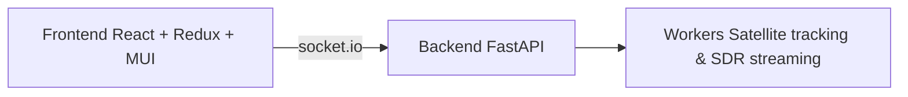

# Ground Station

Ground Station is an open‑source platform that unifies satellite tracking,
radio rig control and real‑time SDR streaming in a single application.  The
project’s goal is to provide an easily deployable “ground station in a box”
for hobbyists and researchers who want to monitor spacecraft, record
transmissions and automate antenna control.

## Architecture



## Technologies and APIs

- **Frontend:** React, Redux Toolkit, Material UI, Vite
- **Realtime:** socket.io for bidirectional events
- **Backend:** Python with FastAPI, SQLAlchemy and Skyfield/SGP4 for orbital mechanics
- **External APIs:** CelesTrak and SatNOGS for TLE data

## SDR Device Support

Dedicated worker processes provide FFT and streaming support for multiple
receiver families:

- **RTL‑SDR** (USB or `rtl_tcp`) workers
- **SoapySDR** devices locally or through SoapyRemote (Airspy, HackRF, LimeSDR, etc.)
- **UHD/USRP** radios via a UHD worker

## Developer Setup

1. **Backend**
   ```bash
   cd backend
   python -m venv venv
   source venv/bin/activate
   pip install -r requirements.txt
   python app.py --host 0.0.0.0 --port 5000
   ```
2. **Frontend**
   ```bash
   cd frontend
   npm install
   npm run dev
   ```
   The development server proxies API and socket traffic to the backend
   port defined in `.env.development` (defaults to `localhost:5000`).

## Docker

The repository includes a multi‑stage `Dockerfile` that builds the React
frontend and a Python environment with SDR libraries.

```bash
docker build -t ground-station .
docker run --rm -p 7000:7000 ground-station
```

Pass `--device` options (for example `--device /dev/bus/usb`) or
`--network host` when hardware access or multicast discovery is required.

---

Licensed under the GNU GPL v3.

