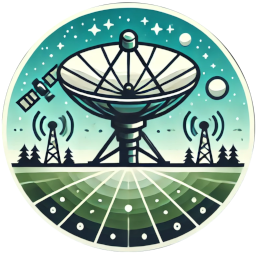
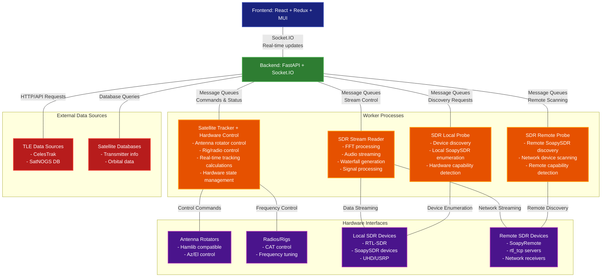

[](https://github.com/sgoudelis/ground-station/actions/workflows/tests.yml) [](https://www.gnu.org/licenses/gpl-3.0)
<div align="center">
  
</div>

# Ground Station 


**Ground Station is a full-featured, open-source software solution for satellite tracking, radio communication, 
and data decoding.** Designed for amateur radio operators, satellite enthusiasts, and researchers, it provides 
a comprehensive and easy-to-use platform for monitoring spacecraft, controlling radio equipment, and receiving 
satellite imagery and telemetry.

## Screenshots

<div align="center">

### Global Satellite Overview


*Real-time global satellite tracking with interactive world map showing satellite positions, ground tracks, and coverage areas*

---

### Satellite Tracking Console


*Dedicated tracking interface for the targeted satellite showing orbital parameters, pass predictions, and real-time position data*

---

### Live Signal Analysis


*Live RF spectrum waterfall demonstrating Doppler effect visualization during active satellite communication*

---

### TLE Data Synchronization


*Automated TLE data synchronization from CelesTrak and SatNOGS showing real-time progress and satellite database updates*

---

### ⚙️ SDR Hardware Management


*Comprehensive SDR device management interface supporting RTL-SDR, SoapySDR, and UHD/USRP radios with remote capability*

</div>

## Key Features

*   **Real-time Satellite Tracking:** Track hundreds of satellites with high-precision orbital models. TLE data is automatically updated from CelesTrak and SatNOGS.
*   **Automated Antenna Control:** Interface with popular antenna rotators to automatically track satellites as they pass overhead.
*   **SDR Integration:** Stream and record live radio signals from a wide range of SDR devices, including RTL-SDR, SoapySDR, and UHD/USRP radios.
*   **Data Decoding:** Decode and display images from weather satellites (e.g., NOAA APT) and telemetry from various amateur satellites.
*   **Responsive Web Interface:** A modern, responsive, and intuitive web interface built with Material-UI that adapts seamlessly to desktop, tablet, and mobile devices, allowing you to control all aspects of the ground station from anywhere on your network.
*   **Multi-User Support:**  Create and manage multiple user accounts with different levels of access and permissions.

## Architecture

The Ground Station application is composed of a frontend, a backend, and a set of worker processes.



*   **Frontend:** The frontend is a single-page application built with React, Redux Toolkit, and Material-UI. It communicates with the backend using a socket.io connection for real-time updates.
*   **Backend:** The backend is a Python application built with FastAPI. It provides a REST API and a socket.io interface for the frontend. It also manages the worker processes.
*   **Workers:** The worker processes are responsible for the heavy lifting. They perform tasks such as satellite tracking, SDR streaming, and antenna control.

## Third-Party Libraries & Technologies

### Backend

*   **[FastAPI](https://fastapi.tiangolo.com/):** A modern, fast (high-performance), web framework for building APIs with Python 3.7+ based on standard Python type hints.
*   **[SQLAlchemy](https://www.sqlalchemy.org/):** The Python SQL Toolkit and Object Relational Mapper that gives application developers the full power and flexibility of SQL.
*   **[Skyfield](https://rhodesmill.org/skyfield/):** A modern astronomy library for Python that computes positions for the stars, planets, and satellites in orbit around the Earth.
*   **[SGP4](https://pypi.org/project/sgp4/):** A Python implementation of the SGP4 satellite propagation model.
*   **[Socket.IO](https://python-socketio.readthedocs.io/en/latest/):** A library for real-time, bidirectional, event-based communication.
*   **[pyrtlsdr](https://pypi.org/project/pyrtlsdr/):** A Python wrapper for the RTL-SDR library.
*   **[SoapySDR](https://pypi.org/project/SoapySDR/):** A vendor and platform neutral SDR support library.

### Frontend

*   **[React](https://reactjs.org/):** A JavaScript library for building user interfaces.
*   **[Redux Toolkit](https://redux-toolkit.js.org/):** The official, opinionated, batteries-included toolset for efficient Redux development.
*   **[Material-UI](https://mui.com/):** A popular React UI framework with a comprehensive suite of UI tools.
*   **[Vite](https://vitejs.dev/):** A build tool that aims to provide a faster and leaner development experience for modern web projects.
*   **[Socket.IO Client](https://socket.io/docs/v4/client-api/):** The client-side library for Socket.IO.
*   **[Leaflet](https://leafletjs.com/):** An open-source JavaScript library for mobile-friendly interactive maps.
*   **[satellite.js](https://github.com/shashwatak/satellite-js):** A JavaScript library to propagate satellite orbits.

## SDR Device Support

Dedicated worker processes provide FFT and streaming support for multiple receiver families:

*   **RTL-SDR** (USB or `rtl_tcp`) workers
*   **SoapySDR** devices locally or through SoapyRemote (Airspy, HackRF, LimeSDR, etc.)
*   **UHD/USRP** radios via a UHD worker

## Getting Started

### Prerequisites

*   Python 3.8+
*   Node.js 14+
*   Docker (optional)

### Installation

1.  **Backend**
    ```bash
    cd backend
    python -m venv venv
    source venv/bin/activate
    pip install -r requirements.txt
    python app.py --host 0.0.0.0 --port 5000
    ```

2.  **Frontend**
    ```bash
    cd frontend
    npm install
    npm run dev
    ```
    The development server proxies API and socket traffic to the backend port defined in `.env.development` (defaults to `localhost:5000`).

## Docker

The repository includes a multi-stage `Dockerfile` that builds the React frontend and a Python environment with SDR libraries.

```bash
docker build -t ground-station .
docker run --rm -p 7000:7000 ground-station
```

Pass `--device` options (for example `--device /dev/bus/usb`) or `--network host` when hardware access or multicast discovery is required.

## Contributing

We welcome contributions! Please see the [CONTRIBUTING.md](CONTRIBUTING.md) file for details on how to get started.

## License

This project is licensed under the GNU GPL v3. See the [LICENSE](LICENSE) file for details.
