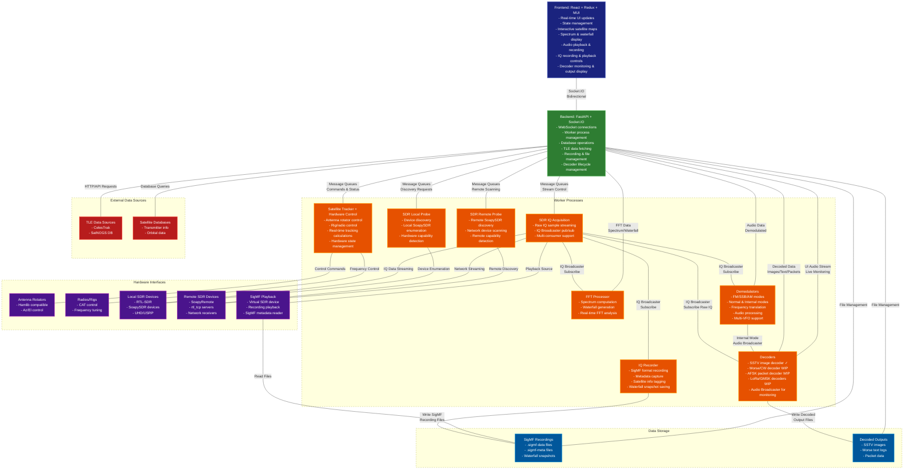
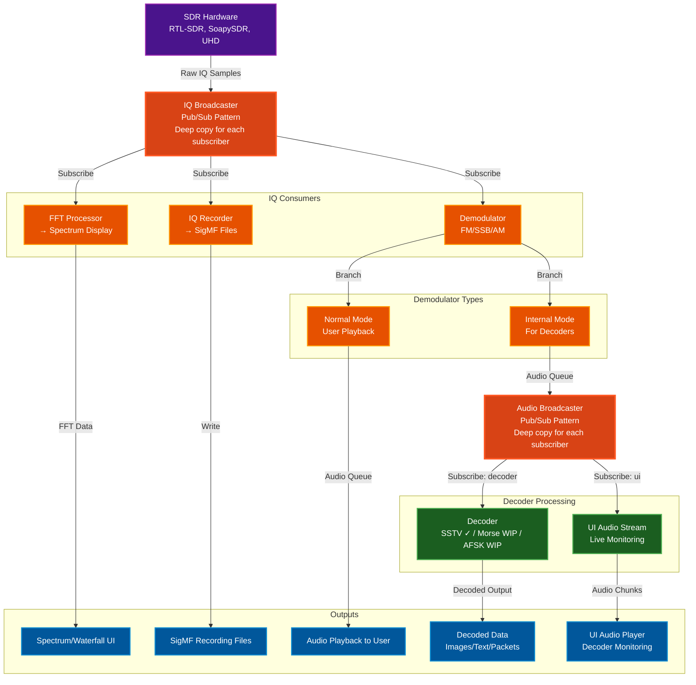

[](https://github.com/sgoudelis/ground-station/actions/workflows/tests.yml) [](https://www.gnu.org/licenses/gpl-3.0) [](https://github.com/sgoudelis/ground-station/actions/workflows/release-from-images.yml)
<div align="center">
  
</div>

# Ground Station


**Ground Station is a full-featured, open-source software solution for satellite tracking and radio communication.** Designed for amateur radio operators, satellite enthusiasts, and researchers, it provides
a comprehensive and easy-to-use platform for monitoring spacecraft, controlling radio equipment, and receiving
live radio signals from satellites.

## Screenshots

<div align="center">

### Global Satellite Overview


*Real-time global satellite tracking with interactive world map showing satellite positions, ground tracks, and coverage areas*

---

### Satellite Tracking Console


*Dedicated tracking interface for the targeted satellite showing orbital parameters, pass predictions, and real-time position data*

---

### SDR Waterfall View


*Live RF spectrum waterfall demonstrating Doppler effect visualization during active satellite communication*

---

### TLE Data Synchronization


*Automated TLE data synchronization from CelesTrak and SatNOGS showing real-time progress and satellite database updates*

---

### SDR Hardware Management


*Comprehensive SDR device management interface supporting RTL-SDR, SoapySDR, and UHD/USRP radios with remote capability*

---

### Performance Monitoring


*Real-time performance monitoring with interactive data flow visualization showing signal processing pipeline, component health, queue utilization, and throughput rates*

</div>

## Key Features

*   **Real-time Satellite Tracking:** Track hundreds of satellites with high-precision orbital models. TLE data is automatically updated from CelesTrak and SatNOGS.
*   **Automated Antenna Control:** Interface with popular antenna rotators to automatically track satellites as they pass overhead.
*   **SDR Integration:** Stream and record live radio signals from a wide range of SDR devices, including RTL-SDR, SoapySDR, and UHD/USRP radios.
*   **IQ Recording & Playback:** Record raw IQ data in SigMF format with complete metadata (center frequency, sample rate, satellite info) and play back recordings through a virtual SDR device for analysis and debugging.
*   **Data Decoding:** Decode SSTV images in real-time with live audio monitoring (additional decoders in development)
*   **AI-Powered Transcription:** Optional real-time speech-to-text transcription of demodulated audio with support for multiple providers:
    *   **Google Gemini Live API:** Real-time transcription with built-in language detection and translation capabilities. Optimized for conversational speech with low latency. See [Gemini API pricing](https://ai.google.dev/gemini-api/docs/pricing).
    *   **Deepgram Streaming API:** Specialized for noisy RF audio environments with excellent performance on radio communications. See [Deepgram pricing](https://deepgram.com/pricing).
    *   **Per-VFO Configuration:** Each VFO can have independent transcription settings (provider, source language, translation target).
    *   **Live Subtitles:** Transcriptions appear as real-time subtitles overlaid on the waterfall display with automatic line wrapping and word-level timing.
    *   **File Output:** All transcriptions are automatically saved to timestamped text files in the `backend/data/transcriptions/` directory.
    *   **Optional Translation:** Deepgram transcriptions can be translated to any language using Google Cloud Translation API.
    *   **Privacy-Conscious:** Requires user-provided API keys. Audio is streamed to external services only when explicitly enabled. All costs and data handling are the user's responsibility.
*   **Performance Monitoring:** Real-time visualization of the signal processing pipeline showing data flow between components (SDR → FFT → Demodulator → Decoder → Browser), queue health monitoring, throughput rates, and component statistics to diagnose bottlenecks and optimize performance.
*   **Responsive Web Interface:** A modern, responsive, and intuitive web interface built with Material-UI that adapts seamlessly to desktop, tablet, and mobile devices, allowing you to control all aspects of the ground station from anywhere on your network.

## Scheduled Observations & Automated Pass Recording

Ground Station includes a comprehensive automated observation system that can schedule and execute satellite passes without user intervention:

*   **Monitored Satellites:** Define satellite monitoring templates with hardware configurations, signal parameters, and task definitions. The system automatically generates scheduled observations for all qualifying passes.
*   **Automated Pass Scheduling:** Automatically calculate and schedule upcoming satellite passes based on configurable criteria (minimum elevation, lookahead window). The scheduler uses APScheduler to trigger observations at AOS (Acquisition of Signal) and stop at LOS (Loss of Signal).
*   **Flexible Task Composition:** Each observation can include multiple concurrent tasks: IQ recording (SigMF format), audio recording (WAV/MP3/FLAC), protocol decoding (AFSK, GMSK, SSTV, APRS, Morse), and optional AI transcription.
*   **Hardware Orchestration:** Automatically controls SDR devices, antenna rotators (with satellite tracking), and rigs (with Doppler correction) during scheduled observations.
*   **Live Observation Capability:** Users can observe any automated pass in real-time through the web interface - view the spectrum waterfall, listen to demodulated audio, and watch live decoder output. When using the same SDR as an automated observation, users can monitor without interference, but be aware that changing the SDR's center frequency or bandwidth will affect the ongoing observation.
*   **Conflict Detection & Resolution:** Smart scheduling system detects overlapping satellite passes and supports multiple resolution strategies (priority-based on elevation, skip conflicting passes, or force scheduling). Dry-run mode allows preview of conflicts before committing.
*   **Status Management:** Real-time observation status tracking (scheduled, running, completed, failed, cancelled, missed) with automatic cleanup of old completed observations.
*   **Session Management:** Automated observations run in isolated internal VFO sessions (namespace: "internal:<observation_id>"). When using different SDRs, user sessions and automated observations operate completely independently without any interference.
*   **Multi-Signal Support:** Within a single SDR observation bandwidth, you can decode multiple signals using VFO markers - for example, simultaneously record IQ on the main frequency, decode APRS from VFO #1, and monitor another signal on VFO #2.

## Planned Features & Roadmap

The following features are planned or in development:

*   **Additional Decoders:**
    *   Morse/CW decoder (in development)
    *   AFSK packet decoder (in development)
    *   LoRa decoders (in development)
    *   NOAA APT weather satellite images
    *   METEOR LRPT weather satellite images
    *   Additional telemetry formats

## Architecture
<a id="arch-v1"></a>

The Ground Station application is composed of a frontend, a backend, and a set of worker processes.

### High-Level System Architecture



### Signal Processing Data Flow

This diagram shows how radio signals flow through the system from SDR hardware to decoders and UI:



#### Key Concepts

**IQ Broadcaster (Pub/Sub Pattern):**
- SDR produces raw IQ samples at high rate (e.g., 2.4 MSPS)
- IQBroadcaster distributes to multiple consumers simultaneously
- Each subscriber gets independent queue with deep-copied samples
- Slow consumers: messages dropped rather than blocking producer
- Supports: FFT processor, demodulators, IQ recorder, decoders (LoRa/GMSK)

**Demodulator Modes:**
- **Normal Mode:** User-controlled VFO → Audio output for playback
- **Internal Mode:** Created automatically by DecoderManager for SSTV/Morse
  - Bypasses VFO checks
  - Fixed parameters (frequency, bandwidth)
  - Feeds AudioBroadcaster instead of direct playback

**Audio Broadcaster (Decoder Pattern):**
- Only used for internal demodulators feeding decoders
- Distributes demodulated audio to:
  - **Decoder subscriber:** SSTV/Morse decoder processing
  - **UI subscriber:** Live audio monitoring in browser
- Statistics tracking: delivered/dropped message counts per subscriber
- Graceful slow consumer handling

**Chain Processing Example (SSTV - Implemented ✓):**
1. SDR → IQBroadcaster → Internal FM Demodulator (12.5 kHz BW)
2. FM Demodulator → AudioBroadcaster input queue
3. AudioBroadcaster → Decoder subscriber → SSTV Decoder → Image output
4. AudioBroadcaster → UI subscriber → Browser audio player (user hears what decoder processes)

**Chain Processing Example (Morse/CW - In Development):**
1. SDR → IQBroadcaster → Internal SSB Demodulator (CW mode, 2.5 kHz BW)
2. SSB Demodulator → AudioBroadcaster input queue
3. AudioBroadcaster → Decoder subscriber → Morse Decoder → Text output
4. AudioBroadcaster → UI subscriber → Browser audio player

**Why Broadcasters?**
- **Decoupling:** Producers don't know about consumers
- **Scalability:** Add consumers without modifying producers
- **Monitoring:** Per-subscriber statistics and health monitoring
- **Reliability:** Slow consumers don't block fast producers

*   **Frontend:** The frontend is a single-page application built with React, Redux Toolkit, and Material-UI. It communicates with the backend using a socket.io connection for real-time updates, including decoded data display and live audio monitoring.
*   **Backend:** The backend is a Python application built with FastAPI. It provides a REST API and a socket.io interface for the frontend. It manages worker processes, decoder lifecycle, and coordinates the pub/sub architecture for signal distribution.
*   **Workers:** The worker processes are responsible for the heavy lifting. They perform tasks such as satellite tracking, SDR streaming, signal demodulation, data decoding (SSTV implemented, Morse/AFSK/LoRa in development), and antenna control. Workers use IQ Broadcaster and Audio Broadcaster for efficient multi-consumer signal distribution.

## Third-Party Libraries & Technologies

### Backend

*   **[FastAPI](https://fastapi.tiangolo.com/):** A modern, fast (high-performance), web framework for building APIs with Python 3.7+ based on standard Python type hints.
*   **[SQLAlchemy](https://www.sqlalchemy.org/):** The Python SQL Toolkit and Object Relational Mapper that gives application developers the full power and flexibility of SQL.
*   **[Skyfield](https://rhodesmill.org/skyfield/):** A modern astronomy library for Python that computes positions for the stars, planets, and satellites in orbit around the Earth.
*   **[SGP4](https://pypi.org/project/sgp4/):** A Python implementation of the SGP4 satellite propagation model.
*   **[Socket.IO](https://python-socketio.readthedocs.io/en/latest/):** A library for real-time, bidirectional, event-based communication.
*   **[pyrtlsdr](https://pypi.org/project/pyrtlsdr/):** A Python wrapper for the RTL-SDR library.
*   **[SoapySDR](https://pypi.org/project/SoapySDR/):** A vendor and platform neutral SDR support library.

### Frontend

*   **[React](https://reactjs.org/):** A JavaScript library for building user interfaces.
*   **[Redux Toolkit](https://redux-toolkit.js.org/):** The official, opinionated, batteries-included toolset for efficient Redux development.
*   **[Material-UI](https://mui.com/):** A popular React UI framework with a comprehensive suite of UI tools.
*   **[Vite](https://vitejs.dev/):** A build tool that aims to provide a faster and leaner development experience for modern web projects.
*   **[Socket.IO Client](https://socket.io/docs/v4/client-api/):** The client-side library for Socket.IO.
*   **[Leaflet](https://leafletjs.com/):** An open-source JavaScript library for mobile-friendly interactive maps.
*   **[satellite.js](https://github.com/shashwatak/satellite-js):** A JavaScript library to propagate satellite orbits.

## SDR Device Support

Dedicated worker processes provide IQ acquisition, FFT processing, and demodulation support for multiple receiver families:

*   **RTL-SDR** (USB or `rtl_tcp`) workers
*   **SoapySDR** devices locally or through SoapyRemote (Airspy, HackRF, LimeSDR, etc.)
*   **UHD/USRP** radios via a UHD worker

The SDR architecture uses a pub/sub pattern (IQ Broadcaster) to separate IQ acquisition from signal processing:
*   **IQ Acquisition Workers** stream raw samples to **IQ Broadcaster**
*   **IQ Broadcaster** distributes to multiple subscribers independently:
    *   **FFT Processor** for spectrum/waterfall display
    *   **Demodulators** (FM/SSB/AM) for audio output in normal and internal modes
    *   **IQ Recorder** for SigMF format file capture
    *   **Raw IQ Decoders** (LoRa, GMSK) that bypass demodulation
*   **Audio Broadcaster** distributes demodulated audio from internal demodulators to:
    *   **Data Decoders** (SSTV ✓, Morse WIP, AFSK WIP) for signal decoding
    *   **UI Audio Stream** for live monitoring in browser

> **Note:** The signal processing components (demodulators, broadcasters, decoders) were developed with assistance from Claude AI (Anthropic) to handle complex DSP algorithms and pub/sub architecture. These components are clearly marked in the source code and are licensed under GPL-3.0 like the rest of the project.

## IQ Recording & Playback

Ground Station includes comprehensive IQ recording and playback capabilities using the [SigMF (Signal Metadata Format)](https://github.com/gnuradio/SigMF) standard:

### Recording Features
*   **SigMF Format:** Records IQ data as `.sigmf-data` files with accompanying `.sigmf-meta` JSON metadata
*   **Automatic Metadata:** Captures center frequency, sample rate, timestamp, and recording duration
*   **Satellite Tracking:** Automatically tags recordings with target satellite name and NORAD ID
*   **Waterfall Snapshots:** Saves PNG snapshots of the waterfall display alongside recordings
*   **Multi-segment Support:** Handles parameter changes (frequency, sample rate) as separate capture segments
*   **Real-time Monitoring:** Live duration counter and visual recording indicator in the UI

### Playback Features
*   **Virtual SDR Device:** Recordings appear as "SigMF Playback" SDR in the device list
*   **Full Processing Pipeline:** Playback supports FFT display, demodulation, and all signal processing
*   **Recording Browser:** Sortable list of recordings with metadata preview (sample rate, duration, timestamp)
*   **Seamless Integration:** Switch between live SDR and playback without changing workflows

### File Organization
Recordings are stored in `backend/data/recordings/` with the following naming convention:
```
<satellite-name>-<frequency>-<timestamp>.sigmf-data
<satellite-name>-<frequency>-<timestamp>.sigmf-meta
<satellite-name>-<frequency>-<timestamp>.png
```

Example: `ISS-145_800MHz-20251105_143022.sigmf-data`

## Getting Started

### Prerequisites

*   Python 3.8+
*   Node.js 14+
*   Docker (optional)

### Installation

#### Option 1: Using pyproject.toml (Recommended)

The backend now uses modern Python packaging with `pyproject.toml`, which provides better dependency management and development tooling.

1.  **Backend Setup**
    ```bash
    cd backend
    python -m venv venv
    source venv/bin/activate  # On Windows: venv\Scripts\activate

    # Install the project in editable mode with all dependencies
    pip install -e .

    # For development (includes testing and code quality tools)
    pip install -e ".[dev]"

    # Start the server
    python app.py --host 0.0.0.0 --port 5000
    ```

2.  **Frontend Setup**
    ```bash
    cd frontend
    npm install
    npm run dev
    ```
    The development server proxies API and socket traffic to the backend port defined in `.env.development` (defaults to `localhost:5000`).

#### Option 2: Using requirements.txt (Traditional)

1.  **Backend**
    ```bash
    cd backend
    python -m venv venv
    source venv/bin/activate  # On Windows: venv\Scripts\activate
    pip install -r requirements.txt

    # For development
    pip install -r requirements-dev.txt

    python app.py --host 0.0.0.0 --port 5000
    ```

2.  **Frontend**
    ```bash
    cd frontend
    npm install
    npm run dev
    ```

### LoRa Decoder Support (GNU Radio + gr-lora_sdr)

The ground station includes a LoRa decoder that uses GNU Radio and gr-lora_sdr for proper LoRa PHY decoding. Due to NumPy 2.x compatibility requirements, GNU Radio must be compiled from source:

**Prerequisites:**
```bash
# Install system dependencies
sudo apt-get install cmake libboost-all-dev libgmp-dev libmpfr-dev \
    liblog4cpp5-dev libspdlog-dev libfmt-dev libvolk-dev \
    pybind11-dev python3-pybind11
```

**Build GNU Radio 3.10 (with NumPy 2.x support):**
```bash
cd ~/projects/ground-station/backend
source venv/bin/activate

# Install Python packages
pip install packaging pybind11

# Clone and build GNU Radio
cd /tmp
git clone --recursive https://github.com/gnuradio/gnuradio.git
cd gnuradio
git checkout maint-3.10
mkdir build && cd build

# Configure to install into venv
cmake -DCMAKE_BUILD_TYPE=Release \
      -DENABLE_PYTHON=ON \
      -DENABLE_GR_QTGUI=OFF \
      -DENABLE_TESTING=OFF \
      -DPython3_EXECUTABLE=$VIRTUAL_ENV/bin/python3 \
      -DPYTHON_EXECUTABLE=$VIRTUAL_ENV/bin/python3 \
      -DCMAKE_INSTALL_PREFIX=$VIRTUAL_ENV \
      ..

# Build and install (takes 15-30 minutes)
make -j$(nproc)
make install
```

**Build gr-lora_sdr:**
```bash
cd /tmp
git clone https://github.com/tapparelj/gr-lora_sdr.git
cd gr-lora_sdr
mkdir build && cd build

cmake -DCMAKE_INSTALL_PREFIX=$VIRTUAL_ENV ..
make -j$(nproc)
make install
```

**Configure library paths:**
```bash
cd ~/projects/ground-station/backend
echo 'export LD_LIBRARY_PATH=$VIRTUAL_ENV/lib:$LD_LIBRARY_PATH' >> venv/bin/activate
source venv/bin/activate
```

**Verify installation:**
```bash
python -c "from gnuradio import gr, lora_sdr; print('LoRa decoder ready!')"
```

> **Note:** This is only required for development. Docker images include pre-built GNU Radio and gr-lora_sdr.

### Development Workflow with pyproject.toml

The project's `pyproject.toml` provides comprehensive tooling configuration:

#### Code Formatting
```bash
# Format code with Black (line length: 100)
black .

# Sort imports with isort
isort .
```

#### Testing

**Backend Tests (Python)**
```bash
cd backend

# Run tests with coverage
pytest

# Run specific test markers
pytest -m unit          # Run only unit tests
pytest -m integration   # Run only integration tests
pytest -m slow          # Run slow tests

# Generate coverage reports
pytest --cov=crud --cov=server --cov=controllers --cov-report=html
```

**Frontend Tests (JavaScript/React)**
```bash
cd frontend

# Run unit/component tests
npm test

# Run with coverage
npm run test:coverage

# Run E2E tests (requires dev server running)
npm run test:e2e

# Run E2E tests with interactive UI
npm run test:e2e:ui
```

See [frontend/TESTING.md](frontend/TESTING.md) for comprehensive testing documentation.

#### Pre-commit Hooks (Recommended)
```bash
# Install pre-commit hooks to automatically check code before commits
pre-commit install

# Run hooks manually on all files
pre-commit run --all-files
```

### Package Information

The project is configured as a Python package with the following metadata:
- **Name:** ground-station
- **Version:** 0.1.0
- **Python Support:** 3.8, 3.9, 3.10, 3.11, 3.12
- **License:** GPL-3.0-only
- **Entry Point:** `ground-station` command (after installation)

You can install the package and use it as a command-line tool:
```bash
pip install -e .
ground-station  # Starts the application
```

## Docker

### Building from Source

The repository includes a multi-stage `Dockerfile` that builds the React frontend and a Python environment with SDR libraries.

```bash
docker build -t ground-station .

# Option 1: Standard bridge mode (works for local SDRs)
docker run --rm -p 7000:7000 --device /dev/bus/usb ground-station

# Option 2: Host networking (required for SoapySDR remote server discovery via mDNS)
docker run --rm --network host --device /dev/bus/usb ground-station
```

### Using Pre-built Docker Images

Pre-built multi-architecture Docker images are available for each release. For detailed instructions on using a specific release, see the [Releases page](https://github.com/sgoudelis/ground-station/releases).

**Quick Start with Docker Image:**

```bash
# Pull the latest image
docker pull ghcr.io/sgoudelis/ground-station:latest
```

**Option 1: With SoapySDR Remote Server Discovery (Recommended)**

Uses host networking to enable automatic mDNS discovery of SoapySDR remote servers:

```bash
docker run -d \
  --network host \
  --name ground-station \
  --restart unless-stopped \
  --device=/dev/bus/usb \
  --privileged \
  -v ground-station-data:/app/backend/data \
  ghcr.io/sgoudelis/ground-station:latest
```

**Option 2: Standard Bridge Mode (No SoapySDR Remote Discovery)**

Uses standard bridge networking with port mapping (works for locally connected SDRs):

```bash
docker run -d \
  -p 7000:7000 \
  --name ground-station \
  --restart unless-stopped \
  --device=/dev/bus/usb \
  --privileged \
  -v ground-station-data:/app/backend/data \
  ghcr.io/sgoudelis/ground-station:latest
```

**Important Notes:**
- The `-v ground-station-data:/app/backend/data` volume mount persists satellite database, TLE data, and configuration between container restarts
- Option 1 (host networking) is required for automatic discovery of SoapySDR remote servers via mDNS
- Option 2 works perfectly for locally connected SDRs and all other features
- Access the web interface at `http://<YOUR_HOST>:7000`

## Contributing

We welcome contributions! Please see the [CONTRIBUTING.md](CONTRIBUTING.md) file for details on how to get started.

## License

This project is licensed under the GNU GPL v3. See the [LICENSE](LICENSE) file for details.
