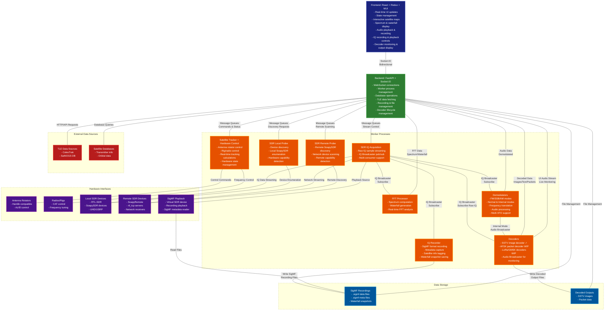
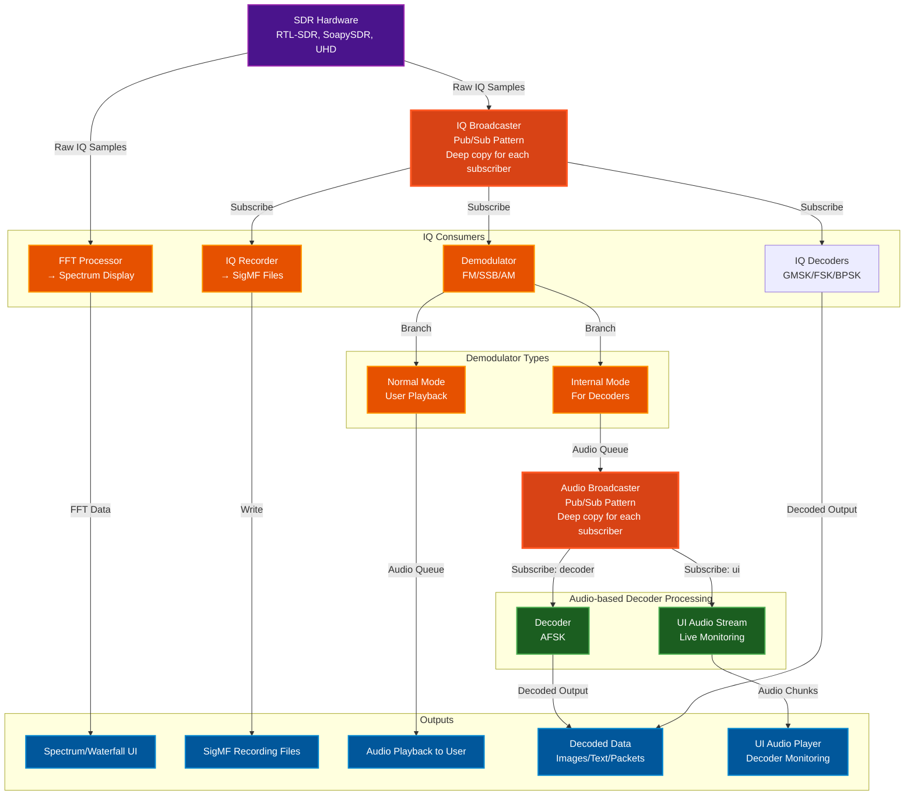

[](https://github.com/sgoudelis/ground-station/actions/workflows/tests.yml) [](https://www.gnu.org/licenses/gpl-3.0) [](https://github.com/sgoudelis/ground-station/actions/workflows/release-from-images.yml)

# Ground Station


**Ground Station is a full-featured, open-source software solution for satellite tracking and radio communication.** Designed for amateur radio operators, satellite enthusiasts, and researchers, it provides
a comprehensive and easy-to-use platform for monitoring spacecraft, controlling radio equipment, and receiving
live radio signals from satellites.
This project was built with the help of Claude Code and Codex.

## Screenshots

<div align="center">

### Global Satellite Overview


*Overview page with quick group selection and real-time satellite status indicators*

---

### Satellite Tracking Console


*Dedicated tracking interface for the targeted satellite showing orbital parameters, pass predictions, and real-time position data*

---

### SDR Waterfall View


*Waterfall view with live transcription overlay during active satellite communication*

---

### Waterfall Packet Decoding (GMSK)


*Waterfall view with live GMSK packet decoding and decoded output details*

---

### Telemetry Packet Viewer (Hex + ASCII)


*Packet viewer showing telemetry payload bytes in hex with ASCII side-by-side*

---

### TLE Data Synchronization


*TLE synchronization page showing real-time progress and satellite database updates*

---

### SDR Hardware Management


*Comprehensive SDR device management interface supporting RTL-SDR, SoapySDR, and UHD/USRP radios with remote capability*

---

### File Browser & Decoders


*File browser view showing decoded weather images, packet outputs, and saved transcriptions*

---

### Observations Overview


*Automated observations dashboard with upcoming passes and task status*

---

### DSP Topology & Performance


*Chain of threads and processes IQ samples pass through, showing performance and data flow across the DSP pipeline*

---

</div>

## Key Features

*   **Real-time Satellite Tracking:** Track hundreds of satellites with high-precision orbital models. TLE data is automatically updated from CelesTrak and SatNOGS.
*   **Automated Antenna Rotator Control:** Interface with popular antenna rotators to automatically track satellites as they pass overhead.
*   **Rig Control (Hamlib):** Control Hamlib-compatible rigs with Doppler correction during satellite passes.
*   **SDR Integration:** Stream and record live radio signals from a wide range of SDR devices, including RTL-SDR, SoapySDR, and UHD/USRP radios.
*   **IQ Recording & Playback:** Record raw IQ data in SigMF format with complete metadata (center frequency, sample rate, satellite info) and play back recordings through a virtual SDR device for analysis and debugging.
*   **Data Decoding:** Decode SSTV, FSK, GFSK, GMSK, and BPSK with AX25 USP Geoscan framing. LoRa and AFSK decoders are currently not working; help is needed.
*   **AI-Powered Transcription:** Real-time speech-to-text for demodulated audio via Gemini Live or Deepgram. Privacy-conscious and user-keyed, with optional translation and file output to `backend/data/transcriptions/`.
*   **Scheduled Observations:** Define detailed observation tasks that automatically listen, decode, transcribe, and record audio and IQ during satellite passes without manual intervention.
*   **SatDump Integration:** Decode weather satellite images from METEOR-M2 (LRPT and HRPT) via SatDump, coupled with automated observations.
*   **Performance Monitoring:** Real-time visualization of the signal processing pipeline showing data flow between components (SDR → FFT → Demodulator → Decoder → Browser), queue health monitoring, throughput rates, and component statistics to diagnose bottlenecks and optimize performance.
*   **Responsive Web Interface:** A modern, responsive, and intuitive web interface built with Material-UI that adapts seamlessly to desktop, tablet, and mobile devices, allowing you to control all aspects of the ground station from anywhere on your network. Works great on a tablet and cell.

## Scheduled Observations & Automated Pass Recording

Ground Station includes a comprehensive automated observation system that can schedule and execute satellite passes without user intervention:

*   **Monitored Satellites:** Define satellite monitoring templates with hardware configurations, signal parameters, and task definitions. The system automatically generates scheduled observations for all qualifying passes.
*   **Automated Pass Scheduling:** Automatically calculate and schedule upcoming satellite passes based on configurable criteria (minimum elevation, lookahead window). The scheduler uses APScheduler to trigger observations at AOS (Acquisition of Signal) and stop at LOS (Loss of Signal).
*   **Flexible Task Composition:** Each observation can include multiple concurrent tasks: IQ recording (SigMF format), audio recording (WAV), protocol decoding (AFSK, GMSK, SSTV), and optional AI transcription.
*   **Hardware Orchestration:** Automatically controls SDR devices, antenna rotators (with satellite tracking), and rigs (with Doppler correction) during scheduled observations.
*   **Live Observation Capability:** Users can observe any automated pass in real-time through the web interface - view the spectrum waterfall, listen to demodulated audio, and watch live decoder output. When using the same SDR as an automated observation, users can monitor without interference, but be aware that changing the SDR's center frequency or bandwidth will affect the ongoing observation.
*   **Multi-SDR Observing:** Automated observations can run on one SDR while additional SDRs record, decode, and listen to the same pass in parallel.
*   **Status Management:** Real-time observation status tracking (scheduled, running, completed, failed, cancelled, missed) with automatic cleanup of old completed observations.
*   **Session Management:** Automated observations run in isolated internal VFO sessions (namespace: "internal:<observation_id>"). When using different SDRs, user sessions and automated observations operate completely independently without any interference.

## Planned Features & Roadmap

The following features are planned or in development:

*   **Additional Decoders:**
    *   AFSK packet decoder
    *   LoRa decoders
    *   NOAA APT weather satellite images
    *   Additional telemetry formats

## Architecture
<a id="arch-v1"></a>

The Ground Station application is composed of a frontend, a backend, and a set of worker processes.

### High-Level System Architecture



### Signal Processing Data Flow

This diagram shows how radio signals flow through the system from SDR hardware to decoders and UI:



#### Key Concepts

**IQ Broadcaster (Pub/Sub Pattern):**
- SDR produces raw IQ samples at high rate
- IQBroadcaster distributes to multiple consumers simultaneously
- Each subscriber gets independent queue with deep-copied samples
- Slow consumers: messages dropped rather than blocking producer
- Supports: FFT processor, demodulators, IQ recorder, decoders (LoRa/GMSK)

**Audio Broadcaster (Decoder Pattern):**
- Only used for internal demodulators feeding decoders
- Distributes demodulated audio to:
  - **Decoder subscriber:** SSTV/AFSK decoder processing
  - **UI subscriber:** Live audio monitoring in browser
- Statistics tracking: delivered/dropped message counts per subscriber
- Graceful slow consumer handling

**Chain Processing Example (SSTV):**
1. SDR → IQBroadcaster → Internal FM Demodulator (SSTV)
2. FM Demodulator → AudioBroadcaster input queue
3. AudioBroadcaster → Decoder subscriber → SSTV Decoder → Image output
4. AudioBroadcaster → UI subscriber → Browser audio player

**Why Broadcasters?**
- **Decoupling:** Producers don't know about consumers
- **Scalability:** Add consumers without modifying producers
- **Monitoring:** Per-subscriber statistics and health monitoring
- **Reliability:** Slow consumers don't block fast producers

*   **Frontend:** The frontend is a single-page application built with React, Redux Toolkit, and Material-UI. It communicates with the backend using a socket.io connection for real-time updates, including decoded data display and live audio monitoring.
*   **Backend:** The backend is a Python application built with FastAPI. It provides a REST API and a socket.io interface for the frontend. It manages worker processes, decoder lifecycle, and coordinates the pub/sub architecture for signal distribution.
*   **Workers:** The worker processes are responsible for the heavy lifting. They perform tasks such as satellite tracking, SDR streaming, signal demodulation, data decoding (SSTV implemented, AFSK/LoRa in development), and antenna control. Workers use IQ Broadcaster and Audio Broadcaster for efficient multi-consumer signal distribution.

## Third-Party Libraries & Technologies

### Backend

*   **[FastAPI](https://fastapi.tiangolo.com/):** A modern, fast (high-performance), web framework for building APIs with Python 3.7+ based on standard Python type hints.
*   **[SQLAlchemy](https://www.sqlalchemy.org/):** The Python SQL Toolkit and Object Relational Mapper that gives application developers the full power and flexibility of SQL.
*   **[Skyfield](https://rhodesmill.org/skyfield/):** A modern astronomy library for Python that computes positions for the stars, planets, and satellites in orbit around the Earth.
*   **[SGP4](https://pypi.org/project/sgp4/):** A Python implementation of the SGP4 satellite propagation model.
*   **[Socket.IO](https://python-socketio.readthedocs.io/en/latest/):** A library for real-time, bidirectional, event-based communication.
*   **[pyrtlsdr](https://pypi.org/project/pyrtlsdr/):** A Python wrapper for the RTL-SDR library.
*   **[SoapySDR](https://pypi.org/project/SoapySDR/):** A vendor and platform neutral SDR support library.
*   **[SatDump](https://github.com/SatDump/SatDump):** Satellite decoder suite used for weather image decoding workflows.
*   **[gr-satellites](https://github.com/daniestevez/gr-satellites):** GNU Radio out-of-tree modules for satellite communications decoding.

### Frontend

*   **[React](https://reactjs.org/):** A JavaScript library for building user interfaces.
*   **[Redux Toolkit](https://redux-toolkit.js.org/):** The official, opinionated, batteries-included toolset for efficient Redux development.
*   **[Material-UI](https://mui.com/):** A popular React UI framework with a comprehensive suite of UI tools.
*   **[Vite](https://vitejs.dev/):** A build tool that aims to provide a faster and leaner development experience for modern web projects.
*   **[Socket.IO Client](https://socket.io/docs/v4/client-api/):** The client-side library for Socket.IO.
*   **[Leaflet](https://leafletjs.com/):** An open-source JavaScript library for mobile-friendly interactive maps.
*   **[satellite.js](https://github.com/shashwatak/satellite-js):** A JavaScript library to propagate satellite orbits.

## SDR Device Support

Dedicated worker processes provide IQ acquisition, FFT processing, and demodulation support for multiple receiver families:

*   **RTL-SDR** (USB or `rtl_tcp`) workers
*   **SoapySDR** devices locally or through SoapyRemote: RTL-SDR, Airspy, HackRF, LimeSDR, UHD/USRP, and SDRplay (RSP series)
*   **UHD/USRP** radios via a UHD worker
*   **Need another SoapySDR device?** Open a GitHub issue and request support.

The SDR architecture uses a pub/sub pattern (IQ Broadcaster) to separate IQ acquisition from signal processing:
*   **IQ Acquisition Workers** stream raw samples to **IQ Broadcaster**
*   **IQ Broadcaster** distributes to multiple subscribers independently:
    *   **FFT Processor** for spectrum/waterfall display
    *   **Demodulators** (FM/SSB/AM) for audio output in normal and internal modes
    *   **IQ Recorder** for SigMF format file capture
*   **Raw IQ Decoders** (BPSK, GMSK) that bypass demodulation
*   **Audio Broadcaster** distributes demodulated audio from internal demodulators to:
*   **Data Decoders** (AFSK) for signal decoding
    *   **UI Audio Stream** for live monitoring in browser

> **Note:** The signal processing components (demodulators, broadcasters, decoders) were developed with assistance from Claude AI (Anthropic) to handle complex DSP algorithms. These components are clearly marked in the source code and are licensed under GPL-3.0 like the rest of the project.

## IQ Recording & Playback

Ground Station includes comprehensive IQ recording and playback capabilities using the [SigMF (Signal Metadata Format)](https://github.com/gnuradio/SigMF) standard:

### Recording Features
*   **SigMF Format:** Records IQ data as `.sigmf-data` files with accompanying `.sigmf-meta` JSON metadata
*   **Automatic Metadata:** Captures center frequency, sample rate, timestamp, and recording duration
*   **Satellite Tracking:** Automatically tags recordings with target satellite name and NORAD ID
*   **Waterfall Snapshots:** Saves PNG snapshots of the waterfall display alongside recordings
*   **Multi-segment Support:** Handles parameter changes (frequency, sample rate) as separate capture segments
*   **Real-time Monitoring:** Live duration counter and visual recording indicator in the UI

### Playback Features
*   **Virtual SDR Device:** Recordings appear as "SigMF Playback" SDR in the device list
*   **Full Processing Pipeline:** Playback supports FFT display, demodulation, and all signal processing
*   **Live-equivalent Decoding:** During playback, demodulators and decoders run exactly as they do with live SDR input
*   **Recording Browser:** Sortable list of recordings with metadata preview (sample rate, duration, timestamp)
*   **Seamless Integration:** Switch between live SDR and playback without changing workflows

## Automated Observations

Ground Station includes an automated observation system for scheduled satellite passes:

*   **Monitored Satellites:** Define satellite monitoring templates with hardware configurations, signal parameters, and task definitions.
*   **Automated Pass Scheduling:** Automatically calculate and schedule upcoming passes based on configurable criteria (minimum elevation, lookahead window).
*   **Flexible Task Composition:** Combine IQ recording (SigMF), audio recording, protocol decoding, and AI transcription in a single observation.
*   **Hardware Orchestration:** Control SDR devices, antenna rotators (with satellite tracking), and rigs (with Doppler correction) during scheduled runs.
*   **Live Observation Capability:** Watch the spectrum waterfall, listen to demodulated audio, and view live decoder output during automated passes.
*   **Multi-SDR Observing:** Run automated observations on one SDR while additional SDRs record, decode, and listen to the same pass in parallel.
*   **Status Management:** Track observation status (scheduled, running, completed, failed, cancelled, missed) with automatic cleanup of old entries.
*   **Session Management:** Automated observations run in isolated internal VFO sessions (namespace: "internal:<observation_id>").

## Getting Started

For development setup, build steps, and testing, see `DEVELOPMENT.md`.

## Docker

### Building from Source

The repository includes a multi-stage `Dockerfile` that builds the React frontend and a Python environment with SDR libraries.

```bash
docker build -t ground-station .

# Option 1: Standard bridge mode (works for local SDRs)
docker run --rm -p 7000:7000 --device /dev/bus/usb ground-station

# Option 2: Host networking (required for SoapySDR remote server discovery via mDNS)
docker run --rm --network host --device /dev/bus/usb ground-station
```

### Using Pre-built Docker Images

Pre-built multi-architecture Docker images are available for each release. For detailed instructions on using a specific release, see the [Releases page](https://github.com/sgoudelis/ground-station/releases).

### Pull the image

```bash
# Latest release tag (recommended)
docker pull ghcr.io/sgoudelis/ground-station:<version>

# Or pull architecture-specific tags directly
docker pull ghcr.io/sgoudelis/ground-station:<version>-amd64
docker pull ghcr.io/sgoudelis/ground-station:<version>-arm64
```

### Run the container

**Option 1: With SoapySDR Remote Server Discovery (Recommended)**

Uses host networking to enable automatic mDNS discovery of SoapySDR remote servers:

```bash
# AMD64
docker run -d \
  --platform linux/amd64 \
  --network host \
  --name ground-station \
  --restart unless-stopped \
  --device=/dev/bus/usb \
  --privileged \
  -v /path/to/data:/app/backend/data \
  -e GS_ENVIRONMENT=production \
  -e GR_BUFFER_TYPE=vmcirc_mmap_tmpfile \
  ghcr.io/sgoudelis/ground-station:<version>

# ARM64 (Raspberry Pi, etc)
docker run -d \
  --platform linux/arm64 \
  --network host \
  --name ground-station \
  --restart unless-stopped \
  -v /dev:/dev \
  --privileged \
  -v /path/to/data:/app/backend/data \
  -e GS_ENVIRONMENT=production \
  -e GR_BUFFER_TYPE=vmcirc_mmap_tmpfile \
  ghcr.io/sgoudelis/ground-station:<version>
```

**Option 2: Standard Bridge Mode (No SoapySDR Remote Discovery)**

Uses standard bridge networking with port mapping:

```bash
# AMD64
docker run -d \
  --platform linux/amd64 \
  -p 7000:7000 \
  --name ground-station \
  --restart unless-stopped \
  --device=/dev/bus/usb \
  --privileged \
  -v /path/to/data:/app/backend/data \
  -e GS_ENVIRONMENT=production \
  -e GR_BUFFER_TYPE=vmcirc_mmap_tmpfile \
  ghcr.io/sgoudelis/ground-station:<version>

# ARM64 (Raspberry Pi, etc)
docker run -d \
  --platform linux/arm64 \
  -p 7000:7000 \
  --name ground-station \
  --restart unless-stopped \
  -v /dev:/dev \
  --privileged \
  -v /path/to/data:/app/backend/data \
  -e GS_ENVIRONMENT=production \
  -e GR_BUFFER_TYPE=vmcirc_mmap_tmpfile \
  ghcr.io/sgoudelis/ground-station:<version>
```

**Important Notes:**
- Replace `/path/to/data` with your desired data directory path
- Option 1 (host networking) is required for automatic discovery of SoapySDR remote servers via mDNS
- Option 2 works for local SDRs and all other features
- For Raspberry Pi hardware, only the Raspberry Pi 5 is recommended
- For ARM64, using `-v /dev:/dev` ensures all USB devices are accessible
- Access the web interface at `http://<YOUR_HOST>:7000`

## Contributing

We welcome contributions! Please see the [CONTRIBUTING.md](CONTRIBUTING.md) file for details on how to get started.

## License

This project is licensed under the GNU GPL v3. See the [LICENSE](LICENSE) file for details.
